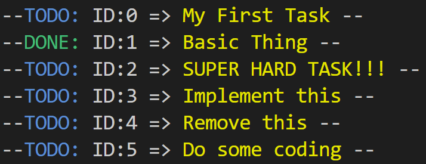

# watodo



A little program that I made in [nim](https://nim-lang.org/) to try out the language.

This is a todo list CLI program that allows the user to create tasks and later mark them as done.

## Build

To build the project on your own machine, make sure you have nim installed correctly and available in your PATH environment variable.

After that you just need to run the following command:
```
$ nimble build 
```
## Usage
The program contains a few simple commands:
```
.\watodo init
.\watodo show
.\watodo begin
.\watodo finish
```

### 'init' command
Initializes a new todo list for the current directory (there can only be 1 todo list per directory) 

### 'show' command
Shows all the registered tasks, displaying their status, ID and the description of the task.

### 'begin' command
Registers a new task into the todo list. During the execution of the command you can specify a name/description for the task.

### 'finish' command
Marks a task as finished. During the execution of this command you will need to specify the ID of the task that you want to finish (you can see the ID of a task through the __show__ command)